Name: Cuiqing Li

Time: 3/4/2017

**Vehicle Detection Project**

The goals / steps of this project are the following:

* Perform a Histogram of Oriented Gradients (HOG) feature extraction on a labeled training set of images and train a classifier Linear SVM classifier
* Optionally, you can also apply a color transform and append binned color features, as well as histograms of color, to your HOG feature vector. 
* Note: for those first two steps don't forget to normalize your features and randomize a selection for training and testing.
* Implement a sliding-window technique and use your trained classifier to search for vehicles in images.
* Run your pipeline on a video stream (start with the test_video.mp4 and later implement on full project_video.mp4) and create a heat map of recurring detections frame by frame to reject outliers and follow detected vehicles.
* Estimate a bounding box for vehicles detected.

[//]: # (Image References)
[image1]: ./examples/car_not_car.png
[image2]: ./examples/HOG_example.jpg
[image3]: ./examples/sliding_windows.jpg
[image4]: ./examples/sliding_window.jpg
[image5]: ./examples/bboxes_and_heat.png
[image6]: ./examples/labels_map.png
[image7]: ./examples/output_bboxes.png
[video1]: ./project_video.mp4

### Here is a demo for my final result(still needs to be modified!)
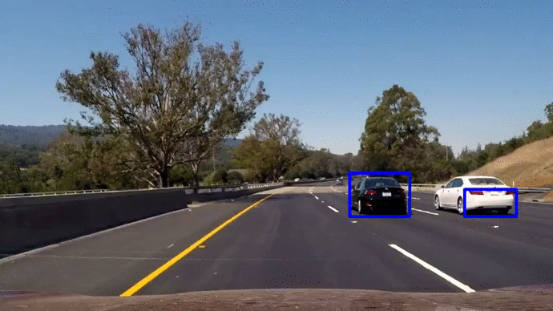

###Histogram of Oriented Gradients (HOG)

####1. How I extracted HOG features from the training images.
Before illustrating the details. let's look at how is hog_image looks like after applying the implemented algorithms:
The first picture is the original car photo, and the second image is the hog image of the photo after applying implemented algorithms:
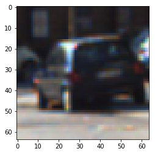
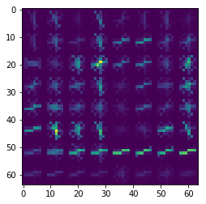


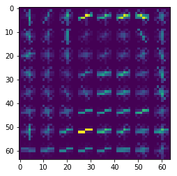


Firstly, as for extracting hog features, I need to use two functions in my python file, one is `get_hog_features(img, orient, pix_per_cell, cell_per_block ,vis=False, feature_vec=True)` from lesson_functions.py file, and another one is `single_img_features` in my Ipython notebook.   

I started by reading in all the `vehicle` and `non-vehicle` images so that I can get hog features in the next steps.

I then explored different color spaces and different `skimage.hog()` parameters (`orientations`, `pixels_per_cell`, and `cells_per_block`).  I grabbed random images from each of the two classes and displayed them to get a feel for what the `skimage.hog()` output looks like.


####2. Final choice of HOG parameters.

I tried various combinations of parameters and found that `orientations=9`, `pixels_per_cell=(8,8)` and `cells_per_block=(2,2)` are the best choice in this project!
Here is the code I used to get final features of my data:
```
feature_training_cars=[]
for file in cars_train:
    img=mpimg.imread(file)
    img_features = single_img_features(img, color_space='RGB', spatial_size=(32,32),\
                                       hist_bins=32, orient=9,\
                                       pix_per_cell=8, cell_per_block=2, hog_channel=0,\
                                       spatial_feat=True, hist_feat=True, hog_feat=True)
    feature_training_cars.append(img_features)
```

####3. Using SVM to train my data
I combined all the train data sets(cars and not-cars) together. After that, I use `1` to represent the photo having cars, and the `0` represent the photos which don't have cars. Then I applied SVM Linear algorithm to train my data, and then used my testing data to test the accuracy of my model!
I used the following parameter's seeting to train my data:
```
color_space = 'YCrCb'
spatial_size = (32,32)
hist_bins = 32
orient = 9
pix_per_cell = 8
cell_per_block = 2
hog_channel = 'ALL'
spatial_feat = True
hist_feat = True
hog_feat = True
```
when using svm to train this classifier, I used hog features, saptial features and hist features to train my model. I found that combining three features can get better training result. Also, setting larger color_space as 'YCrCb' can help identification of the cars become more correct! If so, the classifier will be more reliable(since we have more features and larger feature size), and will have better reliance when facing different kinds of situations in the next cars' vehicle!
###Sliding Window Search

####1. impelmentation of sliding window

This is the original picture shows that how I will search potential locations for cars. The general idea is that pick two or three kinds of windowa to slide along the photo,and resize the picture so that we can use our svc model to predict whether this piece of picture has a car. If it is, using hot_windows array to record the location. If it is not, just ignore it! Here is a picture showing the original search result.

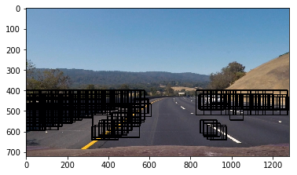

The following is the code demo for search:
As for the sliding window function, I set the window-size as 64, and the overlap ratio as 0.7, the reason is that using 0.7 as overlap can help me to find cars quickly(compared to lower ratio). Also, it is an appropriate size and overlap ratio to find the specific cars

```
windows = slide_window(image, x_start_stop=X_start_stop[i], y_start_stop=Y_start_stop[i], 
                            xy_window=XY_window[i], xy_overlap=XY_overlap[i])
        
        all_windows += [windows]        
        
        hot_windows +=  search_windows(image, windows, svc, X_scaler, color_space=color_space, 
                            spatial_size=spatial_size, hist_bins=hist_bins, 
                            orient=orient, pix_per_cell=pix_per_cell, 
                            cell_per_block=cell_per_block, 
                            hog_channel=hog_channel, spatial_feat=spatial_feat, 
                            hist_feat=hist_feat, hog_feat=hog_feat)      
```

####2. demonstration of pipeline

Ultimately I searched on two scales using YCrCb 3-channel HOG features plus spatially binned color and histograms of color in the feature vector, which provided a nice result.  Here are some example images:

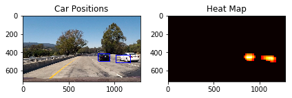

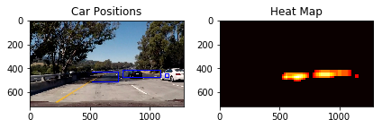

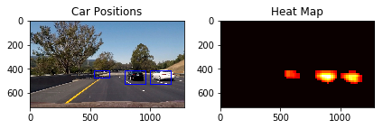

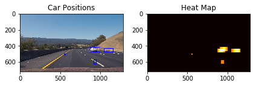

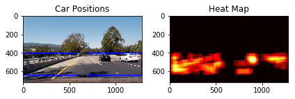

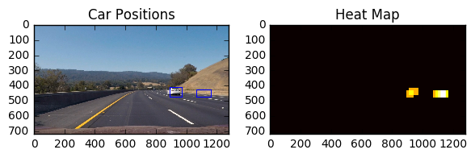

---

### Video Implementation

####1. Video Link for the result of the project!
Here's a [link to my video result](./result.mp4)


####2. How I implemented some kind of filter for false positives and some method for combining overlapping bounding boxes.

I recorded the positions of positive detections in each frame of the video.  From the positive detections I created a heatmap and then thresholded that map to identify vehicle positions.  I then used `scipy.ndimage.measurements.label()` to identify individual blobs in the heatmap.  I then assumed each blob corresponded to a vehicle.  I constructed bounding boxes to cover the area of each blob detected.  

Here's an example result showing the heatmap from a series of frames of video, the result of `scipy.ndimage.measurements.label()` and the bounding boxes then overlaid on the last frame of video:


###Discussion

####1. Problems / issues you faced in your implementation of this project.  
The most difficult thing for this project is that to find appropriate windows for searching cars.  Even if I have a perfect svc model to predict cars, but I still need to spend so much time to work on finding a perfect scale and the size of the window to search cars. Also, since after picking the piece of the pictures, we usually need to resize the picture, so it may result in some noise for the svc model to predict! That's why I feel it is the most hard part for this project!
Originally, the sliding_window falied to identify cars very correctly, and it is because I used wrong color-space 'RGB'. Also, I didn't normalize my data to fit my training data originally. Thus, after normlizing my data and changing my color space, then I get better performance!


